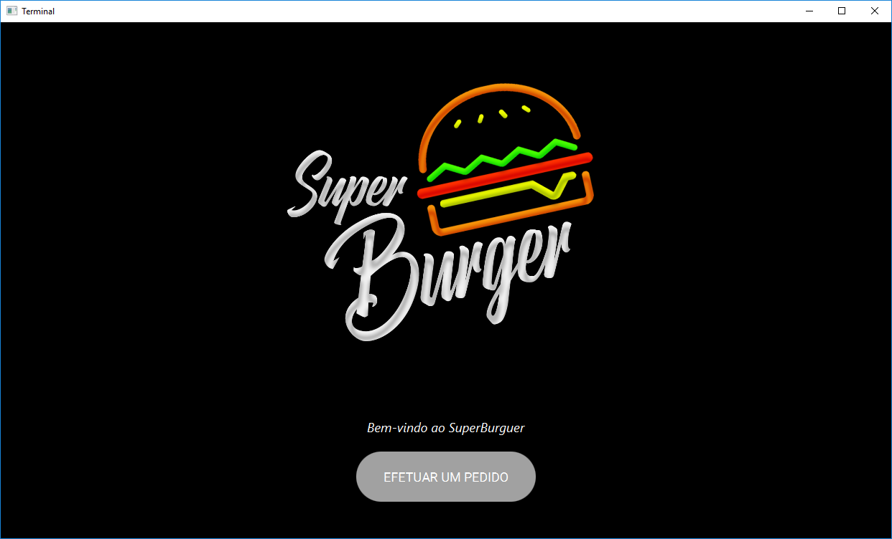
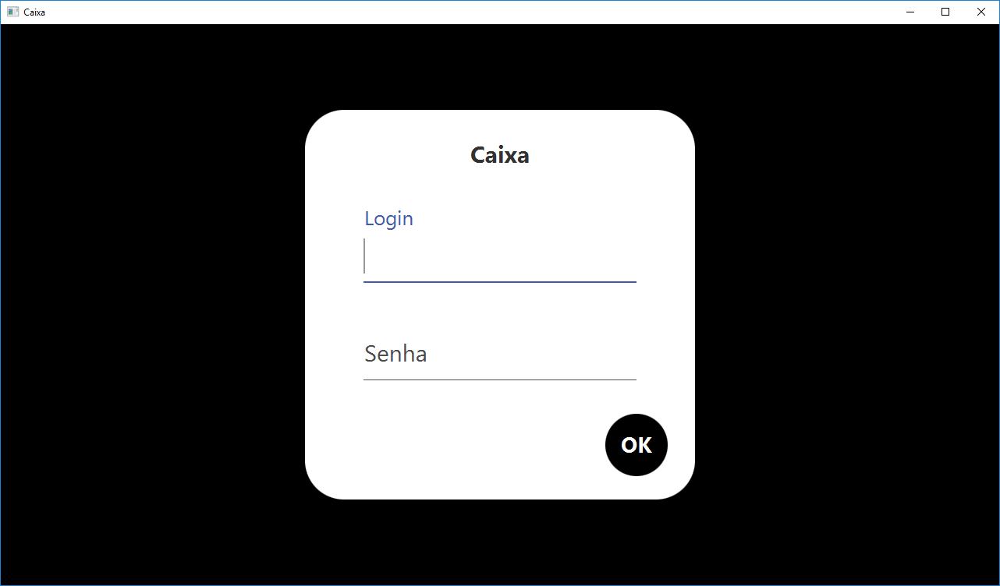

# Sistema Simples de Lanchonote
Um software que simula um sistema de lanchonete com dois executáveis, para o terminal e para o caixa. Foi desenvolvido usando a linguagem de programação Java, o banco de dados foi estruturado usando o SGBD MySql e a interface gráfica foi baseada no framework JavaFX.
Com este sistema é possível gerenciar os produtos que são vendidos por uma lanchonete e concluir pedidos através do software do caixa. Através do software do terminal é possível acessar o cardápio para efetuar um pedido. Essa interação é possível porque as aplicações de caixa e terminal compartilham o acesso do banco de dados.

Para acessar mais imagens de pré-visualização [clique aqui](https://github.com/renanzan/Java_JavaFX_BD_Sistema_de_Lanchonete_Simples/tree/master/preview)

As bibliotecas que são citadas no script de execução estão localizadas na pasta lib

### Pagina Inicial do Terminal


#### Pagina Inicial do Caixa


## Pré-requisitos
```
O código foi confeccionado usando a linguagem de programação Java. Para a interface gráfica foi usado o framework JavaFX, por isso é necesário importar a biblioteca "jfoenix-8.0.8.jar" para que não haja erros durante compilação.

É necessário que um SGBD esteja configurado e instalado na rede local da máquina.
```

## Script de execução
> **Passo 1**
>> Instalar ou executar um SGBD na rede local

>> Na confecção do software foi usado o MySQL

> ***Passo 2 (Fundamental)***
>> Executar os scripts de criação de database e tabelas no SGBD

> *Passo 3 (Facultativo)*
>> Executar os scripts de povoamento do banco de dados

> **Passo 4**
>> Executar uma IDE com suporte à linguagem de programação Java

> **Passo 5**
>> Importar o projeto

> *Passo 6 (Facultativo)*
>> Instalar o Scene Builder

> *Passo 7 (Facultativo)*
>> Configurar o Scene Builder como padrão para leitura de arquivos FXML na IDE

>> *(Eclipse Oxygen.3a Release (4.7.3a))* Window -> Preference -> JavaFX -> Inserir o executável SceneBuilder

> ***Passo 8 (Fundamenal)***
>> Importar a biblioteca "jfoenix-8.0.8.jar"

>> Projeto -> Botão Direito -> Properties -> Java BuildPath -> Libraries -> Add External JARs... -> Selecionar .jar do "jfoenix-8.0.8.jar"

> ***Passo 9 (Fundamenal)***
>> Importar a biblioteca "mysql-connector-java-5.1.46-bin.jar"

>> Projeto -> Botão Direito -> Properties -> Java BuildPath -> Libraries -> Add External JARs... -> Selecionar .jar do "mysql-connector-java-5.1.46-bin.jar"

> **Conclusão**
>> A classe MainCaixa é responsável por executar a aplicação do caixa e a MainTerminal pela do terminal


## Construído com
* [Eclipse IDE](https://www.eclipse.org/) - A IDE utilizada.
* [Scene Builder](https://gluonhq.com/products/scene-builder/) - Software usado para manipular os arquivos FXML da interface.
* [MySQL](https://www.mysql.com/) - SGBD.


## Versões
VERSÃO 1.0.0 [08/07/2019]
* Aplicativos do caixa e do terminal funcionais.
* Obrigatoriedade de autenticação para o software do caixa.
* Caixa possui dois níveis de acesso (caixa e gerente).
* Restrição para CRUD de produtos (apenas o gerente).
* O caixa pode concluir pedidos que foram iniciados pelo terminal.
* Mantém registrado os pedidos que foram pagos e que estão pendentes.
* O terminal apresenta gráficamente os produtos que estão registrados no banco de dados.
* O terminal possibilita ao cliente a inicialização de um pedido.
* O terminal possibilita a remoção e a adição de produtos a sua lista de pedidos.
* Há uma verificação de segurança com o surgimento de um popup para que o cliente finalize o pedido informando o valor final.


## Autores
* **Renan Zanoti** - *Trabalho de Engenharia de Software (Sistemas de Informação, UFOP - ICEA)* - [renanzan](https://github.com/renanzan)
* **Lucas Castro**
* **Diogo**
* **Raphael**
* **Matheus Lucas**
